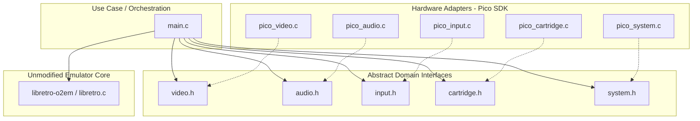

# Project Plan: Odyssey on Pico (Magnavox Odyssey 2 Emulator for RP2040)

This document establishes the architecture, hardware interface specification, and step-by-step roadmap for porting the `libretro-o2em` emulator to run bare-metal on the Raspberry Pi Pico (RP2040) using the Pico SDK.

---

## 1. Architectural Overview & Clean Code Design

To ensure a maintainable and testable system, the project is structured according to **Clean Code** and **Clean Architecture** principles. We decouple the emulated hardware inputs/outputs from the physical RP2040 peripherals by defining abstract interfaces. 

Since the `libretro-o2em` core repository must remain **completely unmodified**, our project serves as a custom bare-metal Libretro frontend. It implements the environment and media callbacks required by the core and translates them to/from our hardware adapters.

### Layered Architecture



### Directory Structure

```
pico-o2em/
├── CMakeLists.txt              # Build configuration linking unmodified core
├── pico_sdk_import.cmake       # Standard Pico SDK helper
├── PLAN.md                     # This plan
├── include/                    # Clean Code Interface Layer (Domain Abstractions)
│   ├── video.h                 # Video interface definitions
│   ├── audio.h                 # Audio interface definitions
│   ├── input.h                 # Joysticks and keyboard interfaces
│   ├── cartridge.h             # Cartridge reader definitions
│   └── system.h                # System timing, clocks, and VFS virtualization
└── src/                        # Clean Code Implementation Layer (Adapters)
    ├── main.c                  # Core execution loop & Libretro frontend callbacks
    ├── pico_video.c            # Composite Video Driver (PIO + DMA + Resistor DAC)
    ├── pico_audio.c            # Sound Driver (PWM slices + IRQ/DMA)
    ├── pico_input.c            # Joypads (74HC165 shift-in) & Keyboard (MCP23017)
    ├── pico_cartridge.c        # Cartridge dumper (74HC595 shift-out + GPIO read)
    ├── pico_system.c           # System virtual VFS, CPU overclocking, and clocks
    └── composite_video.pio     # PIO code for composite sync & luma signal generation
```

---

## 2. Hardware Mapping & Pinout Specification

Below is the pin mapping between the Raspberry Pi Pico and the physical peripherals:

| Pico Pin | GPIO | Device / Peripheral | Target Chip Pin | Technical Function / Signal |
| :--- | :--- | :--- | :--- | :--- |
| **Pino 36** | **3V3** | All logic ICs | VCC / VDD | 3.3V Power Line |
| **Pino 40** | **VBUS** | Cartridge Slot | Pin D (VCC) | +5V Power Line for Cartridge |
| **Vários** | **GND** | RCA sockets, ICs, slot | GND | Common ground reference |
| **Pino 34** | **GPIO 28** | Audio RCA (White) | RCA Left Channel | PWM audio generation (Left) via RC filter |
| **Pino 32** | **GPIO 27** | Audio RCA (Red) | RCA Right Channel | PWM audio generation (Right) via RC filter |
| **Pino 26** | **GPIO 20** | Video RCA (Yellow) | Resistor 1KΩ | Composite Video: Low Luma / Sync |
| **Pino 27** | **GPIO 21** | Video RCA (Yellow) | Resistor 470Ω | Composite Video: Mid Luma / Sync |
| **Pino 29** | **GPIO 22** | Video RCA (Yellow) | Resistor 220Ω | Composite Video: High Luma / Sync |
| **Pino 14** | **GPIO 10** | 2x 74HC165 (Joysticks) | Pin 2 (CP) | Clock signal |
| **Pino 15** | **GPIO 11** | 2x 74HC165 (Joysticks) | Pin 1 (PL/LD) | Latch/Load signal |
| **Pino 16** | **GPIO 12** | 2x 74HC165 (Joysticks) | Pin 9 (Q7) | Serial Data Input |
| **Pino 6** | **GPIO 4** | MCP23017 (Keyboard) | Pin 13 (SDA) | I2C Data line (4.7KΩ external pull-up) |
| **Pino 7** | **GPIO 5** | MCP23017 (Keyboard) | Pin 12 (SCL) | I2C Clock line (4.7KΩ external pull-up) |
| **Pino 19** | **GPIO 14** | 2x 74HC595 (Dumper) | Pin 14 (SER) | Serial Data Input (Address generator) |
| **Pino 20** | **GPIO 15** | 2x 74HC595 (Dumper) | Pin 11 (SRCLK) | Shift Register Clock |
| **Pino 21** | **GPIO 16** | 2x 74HC595 (Dumper) | Pin 12 (RCLK) | Latch / Storage Register Clock |
| **Pino 22** | **GPIO 17** | Cartridge Slot | Pin F (~PSEN) | Chip Enable (Active Low) |
| **Pino 24** | **GPIO 18** | Cartridge Slot | Pin 12 (P11) | Bank Select High |
| **Pino 25** | **GPIO 19** | Cartridge Slot | Pin 13 (P10) | Bank Select Low |
| **Pinos 8-15** | **GPIO 6-13** | Cartridge Slot | Pins 2-9 (DB0-DB7) | Parallel data read bus |

---

## 3. Subsystem Implementation Details

### 3.1. Video Adapter (`pico_video.c` & `composite_video.pio`)
* **Core Output Integration:** In `libretro.c`, the core writes pixel data (RGB565) to the global frame buffer `uint16_t mbmp[400 * 300]`.
* **Hardware Generation:** To output composite video, we bypass standard display controllers. We use a **PIO state machine** to output 3-bit DAC values onto GPIO 20, 21, and 22.
* **Synchronization & Timing:** The PIO handles precise H-sync, V-sync, blanking, and video active region timing. We will use a DMA channel to stream data from a line buffer directly to the PIO FIFO.
* **Buffer Management:** Since the core outputs a 400x300 image, and we are generating composite video (typically ~240 visible lines for NTSC), the adapter will perform a real-time downscaling or cropping (e.g., cropping to the active `320x240` region, as defined by `CROPPED_WIDTH` and `CROPPED_HEIGHT` in `libretro.c`) during the DMA transfer to match the analog TV timing.

### 3.2. Audio Adapter (`pico_audio.c`)
* **Core Output Integration:** The core generates audio samples and places them in `soundBuffer` (size `SOUND_BUFFER_LEN` = 1056 bytes). It calls the frontend callback `retro_audio_sample_batch_t`.
* **Hardware Generation:** We use the RP2040 **hardware PWM slices**. GPIO 27 and 28 are configured as PWM outputs.
* **Audio Loop:** An interrupt handler (triggered by a timer or a PWM wrap event) pulls samples from a circular audio buffer and updates the PWM slice levels using `pwm_set_chan_level`. Dual-mono is achieved by duplicating the mono channel to both GPIO 27 and 28.

### 3.3. Joysticks Adapter (`pico_input.c` - Joysticks)
* **Core Interface:** The core reads inputs by polling `retro_input_state_t`.
* **Hardware Reading:** Two 74HC165 shift registers are daisy-chained to read 16 input buttons. We pull GPIO 11 (Latch) low to lock button states, then pulse GPIO 10 (Clock) 16 times, reading the serial data stream from GPIO 12 (Data In).
* **Mapping:** The 16 bits represent buttons for both Player 1 and Player 2. The adapter maps these bits into the RetroPad layout expected by `retro_input_state_t` (Up, Down, Left, Right, Action).

### 3.4. Keyboard Adapter (`pico_input.c` - Keyboard)
* **Core Interface:** The keyboard matrix directly maps to Odyssey 2's alphanumeric keypad.
* **Hardware Reading:** We use a MCP23017 I2C port expander connected to the keyboard matrix. Port A (GPA0-GPA5) represents the rows, and Port B (GPB0-GPB7) represents the columns.
* **Scanning Algorithm:** We programmatically drive one row low at a time via I2C and read column states. If a key is pressed, it forms a connection, pulling the column low. The adapter translates this row/col pair into key codes that are passed back to the emulator logic.

### 3.5. Cartridge Dumper Adapter (`pico_cartridge.c`)
* **Core Interface:** The core loads a game by calling `retro_load_game` with a memory buffer pointer.
* **Hardware Reading:** At startup, the firmware shifts address lines sequentially through two cascaded 74HC595 shift registers. For each address, we toggle the bank pins (`P10`/`P11`), pull `~PSEN` low, and read the 8-bit data bus parallelly from GPIO 6-13.
* **Buffer Storage:** The read bytes are stored in a static global buffer `rom_buffer` (up to 8KB). Once complete, we power down the dumper pins and invoke `retro_load_game` passing the pointer to `rom_buffer`.

---

## 4. Memory Optimization & CPU Configuration

The RP2040 has **264KB of SRAM**. Because `libretro.c` allocates `mbmp` as a global array of size `400 * 300 * sizeof(uint16_t) = 240,000 bytes` (234.375 KB), we have very tight memory limits.

### Optimization Strategies:
1. **Disable Blend Frames:** In `libretro.c`, if frame blending is enabled, it allocates another `mbmp_prev` buffer via `malloc` (another 240KB). We must ensure `blend_frames` is disabled or forced to NULL, preventing this allocation.
2. **Exclude Unused Subsystems:** We will configure the build with `HAVE_VOICE = 0` to exclude the heavy core audio mixer and resampler code, reducing both flash footprint and RAM allocations.
3. **Linker Script Configurations:** We will customize the CMake compiler flags to use `-Os` (optimize for size) or `-O3` (optimize for speed) and tune the stack sizes to keep them under 4KB per core.
4. **Overclocking:** The RP2040 will be overclocked to `250 MHz` or `270 MHz` to ensure the composite video generation, audio PWM, and Intel 8048 emulation loop run in real-time without skipping frames.

---

## 5. Implementation Roadmap & Milestones

Our development path consists of 7 incremental phases:

```mermaid
gantt
    title Development Phases
    dateFormat  YYYY-MM-DD
    section Milestones
    M1: Compile & Memory Setup   :active, des1, 2026-06-10, 2d
    M2: Bare-metal Frontend & VFS : des2, after des1, 2d
    M3: Cartridge Dumper & BIOS   : des3, after des2, 2d
    M4: PIO Composite Video       : des4, after des3, 3d
    M5: Audio PWM Integration     : des5, after des4, 2d
    M6: Shift Regs & I2C Input    : des6, after des5, 2d
    M7: Testing & Performance     : des7, after des6, 2d
```

### Phase 1: Compilation Infrastructure & Memory Setup
* Create `CMakeLists.txt` configured for the RP2040 board.
* Add compiler flags to link `libretro-o2em` source files.
* Verify memory allocation sizes, check map files, and ensure the compiled executable fits within the 264KB RAM limits.

### Phase 2: Bare-metal Frontend & VFS Virtualizer
* Implement `main.c` containing the entry `main()` function and RetroArch environment callbacks.
* Implement a mock VFS interface to handle BIOS loading (`o2rom.bin`) from an embedded static array in `pico_system.c`.

### Phase 3: Cartridge Dumper implementation
* Implement `pico_cartridge.c` to handle the 74HC595 shift register address lines and GPIO data read.
* Wire this dumper to dump physical carts into `rom_buffer` at boot time, and pass it to `retro_load_game`.

### Phase 4: PIO Composite Video Driver
* Implement `composite_video.pio` to output high-speed sync and luma values.
* Implement `pico_video.c` using DMA to copy active frame buffers to the PIO state machine.

### Phase 5: Audio PWM Driver
* Implement `pico_audio.c` using the hardware PWM API.
* Setup circular buffer and timer interrupt to feed audio samples from the core to the PWM slices.

### Phase 6: Input Drivers (Joysticks & Keyboard)
* Implement `pico_input.c` with the 74HC165 shift register code for joypad polling.
* Add MCP23017 I2C matrix scanning code to map keypad presses.

### Phase 7: Optimization & Verification
* Profile performance and implement frame throttling to match NTSC (60Hz) timing.
* Verify stability under various cartridge emulation scenarios.
